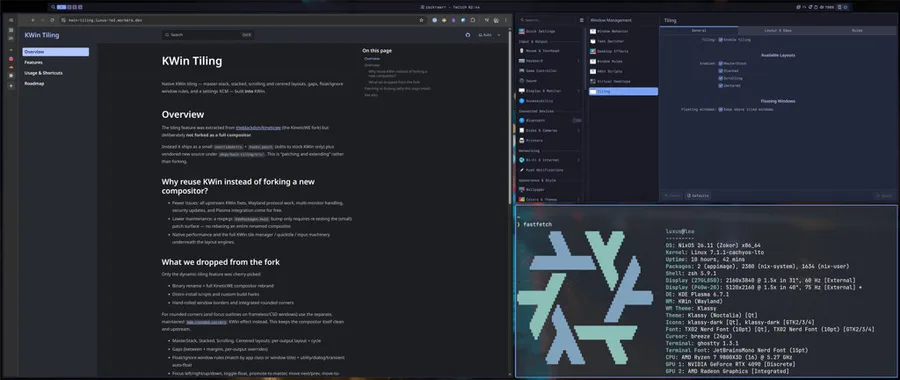

# kwin-tiling

Native dynamic tiling built **into** KWin — master-stack, stacked, scrolling, and
centred layouts, gaps, float/ignore window rules, and a settings KCM — packaged
as a small `overrideAttrs` + `hooks.patch` over stock `kdePackages.kwin` (not a
compositor fork).

It is **not** a fork: the bulk of the feature is vendored as normal source under
`pkgs/kwin-tiling/src/` (mirroring KWin's own layout) and copied into the build
tree; `hooks.patch` carries **only** the edits to existing KWin files plus the
CMake wiring. A nixpkgs/Plasma bump just needs that small patch re-tested.

See the docs site under `website/` (Overview / Features / Usage / KWin +
Noctalia session / Roadmap) for the full feature list, shortcuts, and minimum
KDE session wiring for Noctalia, and `pkgs/kwin-tiling/README.md` for
implementation/maintenance notes.



## Two ways to start

**1. KDE Plasma + tiling (very easy)** — add the flake module to your host, log
into your normal Plasma Wayland session, enable tiling in `kwinrc` or *System
Settings → Window Management → Tiling*. No session changes; plasmashell and the
rest of Plasma stay as they are.

**2. KWin + Noctalia (custom session)** — same patched KWin, but in a minimal
Wayland session with [Noctalia](https://github.com/noctalia-dev/noctalia) as
the shell instead of plasmashell. Needs extra session wiring (systemd units,
portals, env). See the docs site page **KWin + Noctalia session** for a
self-contained NixOS + Home Manager example (`examples/patches/` has the
Noctalia patches).

## Use it from your flake

```nix
{
  inputs.kwin-tiling.url = "github:luxus/kwin-tiling";

  # In a NixOS host config:
  imports = [ inputs.kwin-tiling.nixosModules.kwin-tiling ];
  # ^ replaces kdePackages.kwin with the patched build for this host.
}
```

Or just take the overlay / package directly:

```nix
nixpkgs.overlays = [ inputs.kwin-tiling.overlays.default ];   # kdePackages.kwin -> patched
# or
environment.systemPackages = [ inputs.kwin-tiling.packages.${system}.kwin-tiling ];
```

Enable tiling at runtime via `~/.config/kwinrc`:

```ini
[Tiling]
Enabled=true
```

…or in *System Settings → Window Management → Tiling*.

> Patching KWin rebuilds the compositor and its reverse-deps, so compose the
> module only onto the hosts that actually want native tiling — not globally.
> Wiring a binary cache for this repo is strongly recommended; otherwise every
> consumer rebuilds KWin from source.

## Build & check

```sh
nix build .#kwin-tiling     # the patched compositor (long: compiles KWin)
nix flake check             # fast: runs the pure column-math self-check, no KWin build
```

## Maintenance

Edit the feature directly under `pkgs/kwin-tiling/src/`. For changes to
*existing* KWin files, edit them in a KWin checkout and regenerate
`pkgs/kwin-tiling/hooks.patch` (never hand-edit the patch text). On a
nixpkgs/Plasma bump, rebuild and fix any rejected hunks — the vendored `src/`
files are additive and rarely conflict; the hooks into
`window`/`workspace`/`useractions`/`input`/`tiles` are the risk surface.

## Origin

The goal was smooth native tiling inside KWin — not another KWin script hitting
the script API ceiling — without maintaining a compositor fork. This repo patches
stock KWin with vendored source and a small hooks patch instead.

Early inspiration came from
[theblackdon/kineticwe](https://gitlab.com/theblackdon/kineticwe), a fork that
showed native tiling could live in the compositor. We ported ideas and features,
not the fork — little of that code remains. Compared to carrying the full fork
(~3,300 tracked files, 123 diverging `src/` files today), we touch **37** files
(**22** vendored + **15** hooked, +468/−38 lines in `hooks.patch`) and skip its
QPainter backend, hand-rolled borders, install scripts, and binary rename. For
rounded corners use the separate
[kde-rounded-corners](https://github.com/matinlotfali/KDE-Rounded-Corners)
effect.
